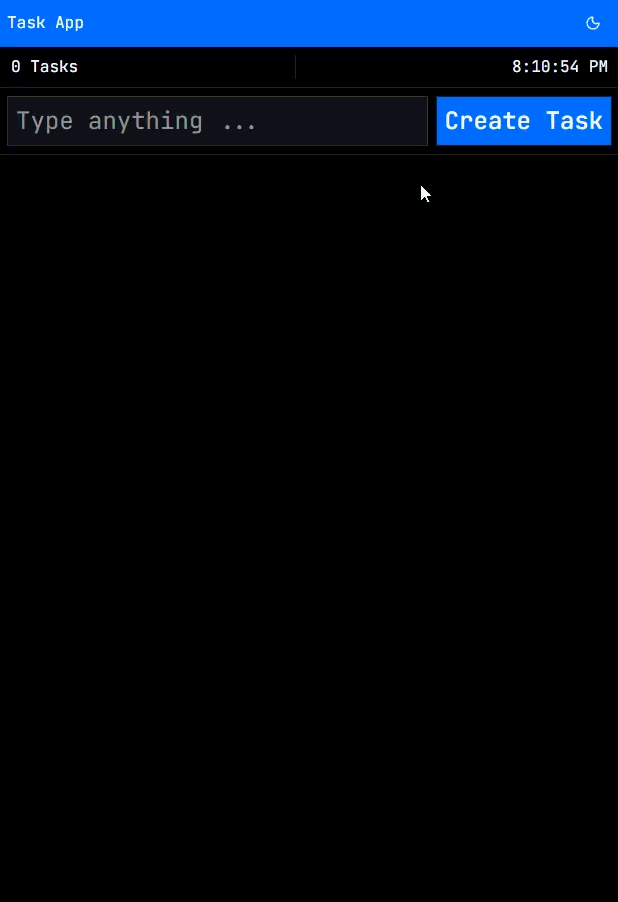

# Simple Todo App

A lightweight Todo application built with React, TypeScript, and modern UI libraries.

## Preview



## Setup

### Clone repo

```bash
git clone https://github.com/devmoamal/Todo-ReactJs.git
cd Todo-ReactJs
```

### Install packages

```bash
npm install
```

## Technologies

- Vite
- ReactJs
- Typescript
- Tailwindcss v4
- Shadcn/ui
- Zod
- Zustand
